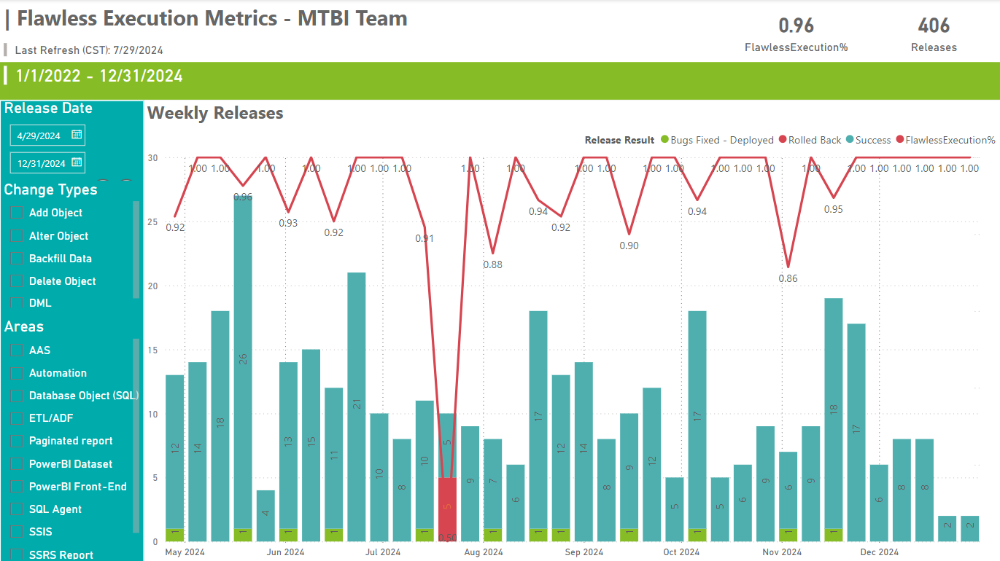
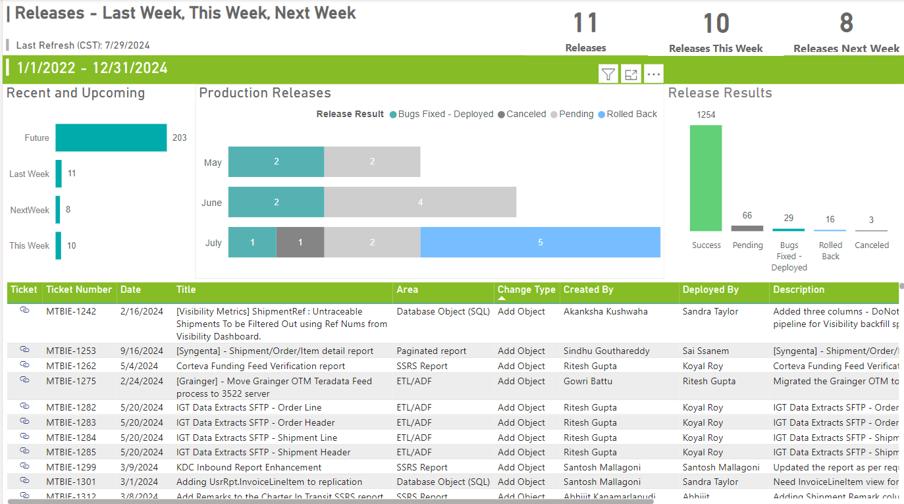
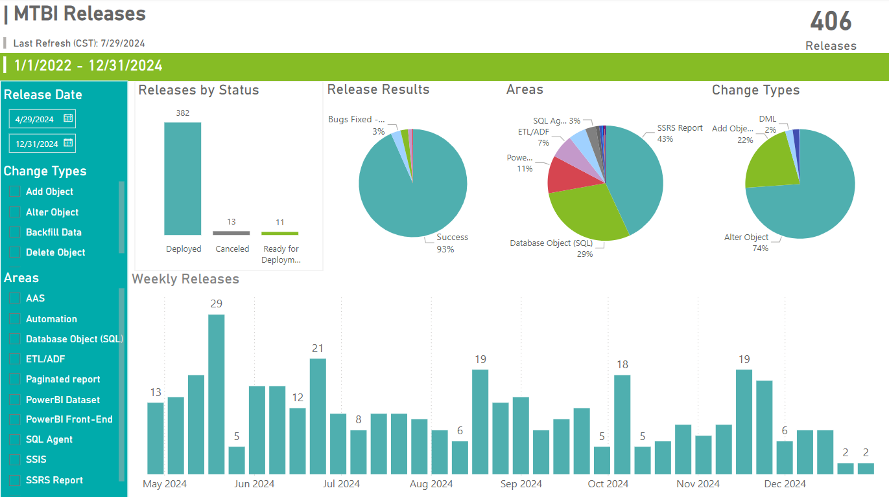

# Power-BI_Version-Control-Dashboard
This is my Power BI Project for the University of South Florida Master Program in Artificial Intelligence and Business Analytics.

## Project Overview

This Power BI project aims to provide a comprehensive dashboard for version control analysis for Production Environmen, focusing on tracking changes, contributions, and performance metrics over time. This is a version control dashboard that can be used by any organization for tracking changes in their production server. The project utilizes various datasets to offer insights into version control activities and their impact on project outcomes.

## Project Files

- `Version Control Dashboard.pbix`: Power BI report file.
- `Tabs/`: Directory containing images used in the report.

## Project Structure

- **Tab 1: MTBI Releases-BI Data**: Analysis of version control metrics.
- **Tab 2: Current Releases**: Insights on contributions by different team members.
- **Tab 3: Global Releases**: Performance analysis over different time periods.

## Research Questions

1. How does the number of weekly releases correlate with the Flawless Execution Percentage over time?
2. Are there specific months or periods with a higher incidence of rolled-back releases or bug fixes?
3. What is the distribution of release results (Success, Pending, Bugs Fixed - Deployed, Rolled Back, Canceled) over the specified period?
4. How do the types of changes (e.g., Add Object) and the areas they impact (e.g., Database Object (SQL), ETL/ADF) correlate with the release success rates?
5. How do the release areas (e.g., Database Object (SQL), SSRS Report, ETL/ADF) impact the overall release success rate and frequency?

### 1. How does the number of weekly releases correlate with the Flawless Execution Percentage over time?

#### Explanation
The chart shows a correlation between the number of weekly releases and the Flawless Execution Percentage. Generally, periods with higher release volumes, such as May and December 2024, show a high Flawless Execution Percentage, indicating efficient handling of releases. However, there are exceptions, like August 2024, where a lower number of releases coincides with a significant drop in Flawless Execution Percentage to 0.50. This suggests that while high volumes can be managed successfully, other factors may influence execution quality, requiring further investigation into process and resource management.

### 2. Are there specific months or periods with a higher incidence of rolled-back releases or bug fixes?

#### Explanation
Yes, the chart highlights specific periods with higher incidences of rolled-back releases or bug fixes. Notably, August 2024 stands out with a significant drop in Flawless Execution Percentage to 0.50, indicating multiple rolled-back releases. This period shows 5 releases, all of which were problematic. Additionally, July 2024 shows a lower Flawless Execution Percentage of 0.91 with visible instances of issues, suggesting these months experienced higher release failures. Other months, like May and December 2024, maintained high execution percentages, indicating fewer issues during those periods. This analysis helps identify critical periods requiring process improvements.

### 3. What is the distribution of release results (Success, Pending, Bugs Fixed - Deployed, Rolled Back, Canceled) over the specified period?

#### Explanation
The distribution of release results over the specified period is as follows:

Success: The majority of releases were successful, with 1,254 out of the total releases achieving success.
Pending: There are 66 releases that are currently in a pending state.
Bugs Fixed - Deployed: A smaller number, 29 releases, required bug fixes before they could be deployed.
Rolled Back: There are 16 releases that were rolled back due to issues.
Canceled: A few releases, specifically 3, were canceled during this period.
This distribution shows that a high percentage of releases were successful, but there are also notable instances of releases needing fixes or being rolled back.

### 4. How do the types of changes (e.g., Add Object) and the areas they impact (e.g., Database Object (SQL), ETL/ADF) correlate with the release success rates?

#### Explaination
The tab shows a correlation between change types, impacted areas, and release success rates. "Add Object" is the most common change type, likely contributing significantly to both successes and issues. "Database Object (SQL)" and "SSRS Report" are the most impacted areas, making up 29% and 43% of changes, respectively. These areas have a substantial influence on overall success rates. While "ETL/ADF" and other areas have smaller proportions, their specific nature means any issues can significantly affect success rates. Detailed analysis of success rates per change type and area would provide more insights.

### 5. How do the release areas (e.g., Database Object (SQL), SSRS Report, ETL/ADF) impact the overall release success rate and frequency?

#### Explaination
The dashboard indicates that different release areas impact the overall release success rate and frequency significantly. "SSRS Report" changes constitute 43% of releases, suggesting a major focus area with a high success rate. "Database Object (SQL)" changes make up 29%, also playing a crucial role in the overall success, with frequent releases contributing to a consistent success rate. "ETL/ADF" changes, at 7%, are less frequent but still vital for success. The high success rate of 93% overall reflects well-managed processes across these areas, though their frequency and specific challenges may vary.

## Contributing

Contributions are welcome. Please open an issue or submit a pull request for any enhancements or bug fixes.

## Acknowledgments

- Akanksha Kushwaha for project submission.